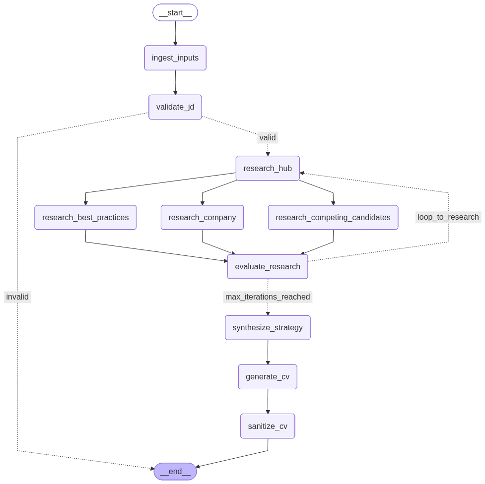

# Job Application Research & Tailoring Agent

An AI-powered multi-agent pipeline built with **LangGraph**, **LangChain**, and **OpenRouter** to research companies and tailor CVs for specific job descriptions with built-in hallucination protection.

## Features
- **JD Ingestion & Validation**: Supports URLs and local files. Automatically verifies if the content is a valid job description.
- **Parallel Intelligence**: Simultaneously researches the Hiring Company, Role Best Practices, and LinkedIn Competing Candidate Profiles (X-Ray Sourcing).
- **Self-Refining Loop**: Evaluates research for gaps and recursively refines data (up to 3 iterations).
- **CV Sanitization**: A dedicated auditor node that compares the tailored CV against your **Source of Truth** (YAML) to detect and remove hallucinations.
- **Multi-Tiered Models**: Uses faster models (`GPT-4o mini`) for research and stronger models (`GPT-5 mini`) for critical synthesis and auditing.
- **Organized Outputs**: Chronological, timestamped directories for every run.

## Workflow Architecture
The agent uses a parallel fan-out/fan-in pattern with a self-correcting refinement and sanitization loop:



## Setup

1. **Install Dependencies**:
   ```bash
   pip install -r requirements.txt
   ```

2. **Configure Environment**:
   Create a `.env` file in the root directory:
   ```bash
   OPENROUTER_API_KEY=your_openrouter_api_key
   TAVILY_API_KEY=your_tavily_api_key
   MODEL_VERSION=openai/gpt-4o-mini
   STRONG_MODEL_VERSION=openai/gpt-5-mini
   ```

## Usage

### Tailor a CV
Uses your master YAML CV and targets a specific job:
```bash
python main.py --cv data/base_cv/master_cv.yaml --jd "https://company.com/job-url"
```

### Evaluation Suite
Run a parallel, semantic hallucination check against all JDs in `data/eval_jd/`:
```bash
make evaluate
```

### Utility Commands
| Command | Description |
| :--- | :--- |
| `make lint` | Run Ruff linting and formatting checks |
| `make test` | Run the unit test suite |
| `python main.py --visualize` | Generate the `workflow.png` diagram |
| `python main.py --pdf <file.md>` | Render an existing Markdown file to a styled PDF |

## CLI Arguments
| Argument | Description | Default |
| :--- | :--- | :--- |
| `--cv` | Path to your original CV (YAML, PDF, or TXT) | `data/base_cv/master_cv.yaml` |
| `--jd` | URL or path to the Job Description | (Apple MLE Job URL) |
| `--model` | Primary model for research | `openai/gpt-4o-mini` |
| `--personalize` | Custom instructions for the LLM | None |

## Outputs
Each run saves to `data/output/YYYYMMDD_HHMMSS/`:
- `TAILORED_CV.pdf`: The final professionally formatted resume.
- `STRATEGY_REPORT.pdf`: Detailed research and tailoring strategy.
- `metadata.json`: Logs the inputs, model versions, and audit status.
